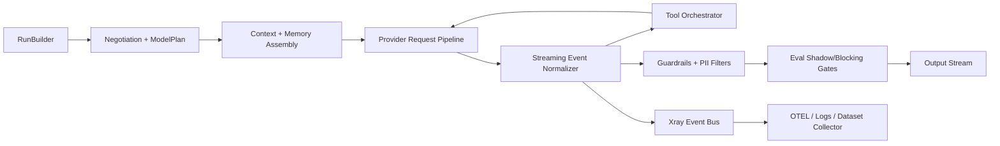

# AI Harness SDK Contract (Rust) - Evidence-Backed V2

Date: February 9, 2026  
Status: Proposed contract for a new crate family rooted at `crates/orchestrator-ai-harness-*`  
Scope: User-facing SDK API + implementation plan for internals

## 1) Decision Framing

### Decision to make now
Define a production-grade, consumer-friendly Rust SDK contract for an AI harness that covers all required capabilities (1-37) and specifies a practical internal architecture and source-module strategy that can be built incrementally without painting us into a corner.

### In scope
- User-facing API contract only (Rust).
- Capability-complete design for the 37 requested capabilities.
- Evidence-backed module choices and integration options.
- Internal execution plan deep enough for implementation kickoff.
- Evals-first architecture and gating.

### Out of scope
- UI surface (terminal/web/desktop).
- Concrete provider billing/pricing policy logic.
- Final persistence schema migrations.
- Full implementation in this doc.

### Constraints
- Must stay Rust-native, performance-conscious, memory-aware, correctness-first.
- Must support high provider/model change velocity.
- Must keep consumer API simple while keeping internals extensible.

### Assumption ledger
- `A1`: Consumers want one high-level `Harness` API with optional deep controls.
- `A2`: Capability negotiation is mandatory for safe multi-provider routing.
- `A3`: Evals must be integrated into runtime decisions (shadow + blocking).
- `A4`: MCP is a first-class integration path, not an afterthought.

### Decision delta (V2, contract-affecting)
- `D1`: Responsibilities are split into three layers: `Kernel` (must be in harness core), `Extensions` (first-party optional modules), and `Wrappers` (UX/workflow layers over control-plane APIs).
- `D2`: `Todos`, `approvals`, and high-level `steering UX` move out of core kernel and are modeled as wrapper responsibilities over core interrupt/command primitives.
- `D3`: Add first-class change journal and explicit undo/compensation APIs to avoid ambiguity between replay and true undo.
- `D4`: Keep performance-critical concerns (`streaming`, `backpressure`, `retry`, `timeouts`, `capability negotiation`, `zero-copy buffers`) in kernel.
- `D5`: Keep policy-heavy, rapidly changing concerns (`guardrails packs`, `PII detection packs`, `eval adapters`, `memory backends`, `MCP bridges`) in extension crates.

---

## 2) Market and Reference Landscape ("others like pi-mono")

## Direct and adjacent references

| Project / Platform | What it proves | Relevance to this SDK |
|---|---|---|
| [badlogic/pi-mono](https://github.com/badlogic/pi-mono/) | Integrated agent toolkit: unified multi-provider API, agent runtime, tool/state support | Closest conceptual reference for full harness scope |
| [rig.rs](https://github.com/0xPlaygrounds/rig) | Rust-first agentic workflows, streaming, semantic-convention alignment | Strong Rust ergonomics + composability patterns |
| [LiteLLM](https://docs.litellm.ai/) | Unified multi-provider model API, retries/fallbacks/router patterns | Routing/fallback architecture ideas |
| [OpenRouter provider routing](https://openrouter.ai/docs/guides/routing/provider-selection) | Provider ordering, fallback behavior, capability/parameter constraints (`require_parameters`) | Capability-aware fallback plans |
| [OpenAI Responses/Streaming](https://platform.openai.com/docs/guides/streaming-responses) | Typed streaming events, tool-call event model, multimodal/tool primitives | Event normalization model |
| [Anthropic fine-grained tool streaming](https://docs.anthropic.com/en/docs/agents-and-tools/tool-use/fine-grained-tool-streaming) | Partial tool-arg streaming and invalid/partial JSON edge cases | Tool streaming parser requirements |
| [Gemini function calling](https://ai.google.dev/gemini-api/docs/function-calling) | Mode controls (`AUTO/ANY/NONE`), parallel/compositional function calling | Tool orchestration and policy alignment |
| [MCP spec lifecycle](https://modelcontextprotocol.io/specification/latest/basic/lifecycle) | Protocol version + capability negotiation at init | Capability negotiation contract |
| [MCP sampling](https://modelcontextprotocol.io/specification/2025-11-25/client/sampling) | Nested model sampling, HITL guidance, tool use in sampling | MCP client integration + approvals |
| [MCP tools](https://modelcontextprotocol.io/specification/draft/server/tools) | Tool exposure model + HITL recommendations | Tool registry interoperability |

---

## 3) Evidence Table (Facts, Inferences, Gaps)

### 3.1 Core facts used in this design

| Claim | Fact/Inference | Evidence | Date context | Confidence |
|---|---|---|---|---|
| Typed streaming events are now standard for modern APIs | Fact | OpenAI streaming docs list typed event families | Accessed February 8, 2026 | High |
| Tool argument streaming may be partial/invalid JSON mid-stream | Fact | Anthropic fine-grained tool streaming warns about partial/invalid JSON | Accessed February 8, 2026 | High |
| Gemini supports explicit function-calling modes and parallel/compositional calls | Fact | Gemini function-calling docs + capability table | Last updated December 18, 2025; accessed February 8, 2026 | High |
| MCP requires lifecycle initialization with protocol version + capabilities | Fact | MCP lifecycle spec | Protocol revision 2025-11-25; accessed February 8, 2026 | High |
| MCP sampling supports text/audio/image and tool-enabled sampling | Fact | MCP sampling spec | Protocol revision 2025-11-25; accessed February 8, 2026 | High |
| Mature SDKs separate runtime-core concerns from UI concerns | Fact | AI SDK docs (`AI SDK Core` vs `AI SDK UI`) | Accessed February 9, 2026 | High |
| MCP architecture separates host/client/server roles and emphasizes capability negotiation | Fact | MCP architecture + lifecycle specs | Accessed February 9, 2026 | High |
| Modern agent SDKs treat guardrails and HITL as explicit modular concerns | Fact | OpenAI Agents guides (`guardrails`, `human-in-the-loop`) | Last modified February 7, 2026; accessed February 9, 2026 | High |
| Evals, durable execution, and UI event streams are often documented as separate integration tracks | Fact | PydanticAI docs (`evals`, `durable_execution`, `ui`) | Accessed February 9, 2026 | High |
| Undo for distributed side effects is typically modeled with compensation actions, not DB rollback | Fact | Temporal Saga compensating actions article | Accessed February 9, 2026 | High |
| Bounded async channels provide explicit backpressure semantics | Fact | Tokio mpsc docs | Accessed February 8, 2026 | High |
| `bytes::Bytes` supports cheap clone + slice and zero-copy patterns | Fact | bytes docs | bytes 1.11.1 docs accessed February 8, 2026 | High |
| Tower provides retry, retry-budget, timeout, and concurrency limit middleware | Fact | tower retry + limit docs | Accessed February 8, 2026 | High |
| Promptfoo supports pass-rate threshold and fail-exit behavior via env vars | Fact | Promptfoo command-line docs (`PROMPTFOO_PASS_RATE_THRESHOLD`, `PROMPTFOO_FAILED_TEST_EXIT_CODE`) | Accessed February 8, 2026 | High |
| OpenTelemetry GenAI semantic conventions are available (still evolving) | Fact | OTel GenAI semconv docs marked Development | Accessed February 8, 2026 | High |
| Regex crate guarantees worst-case O(m*n) search bound | Fact | regex docs | Accessed February 8, 2026 | High |
| Aho-Corasick supports high-throughput multi-pattern scanning | Fact | aho-corasick docs | Accessed February 8, 2026 | High |

### 3.2 Inferences we make

| Inference | Why it follows | Risk |
|---|---|---|
| We need event normalization independent of provider SDKs | Provider event models differ and evolve quickly | Low |
| A three-layer ownership model (kernel/extensions/wrappers) gives better long-term API stability | Core/runtime concerns and UX/policy concerns evolve at different rates | Low |
| Tool execution should be runtime-pluggable with strict schema validation | Needed for custom tools + correctness + security | Low |
| Eval gating must include shadow mode before hard block | Reduces false-positive production impact | Low |
| Capability negotiation must happen on every run plan, not only startup | Provider/model capability drift is frequent | Medium |

### 3.3 Evidence gaps

- Precise long-term stability of provider-specific "reasoning trace" formats.
- Durable cross-provider video input/output parity details.
- Rust-native, broadly adopted PII+NER pipeline maturity compared to Python ecosystem.
- Domain-specific compensation catalogs for undo need per-tool curation and validation.

---

## 4) API Contract (User-Facing)

This contract is intentionally split into:
- `Simple API`: fast path with safe defaults.
- `Advanced API`: explicit control over context, memory, routing, eval gating, observability.
- `Responsibility layers`: kernel vs extension vs wrapper, so core stays stable and high-performance.

## 4.1 Public module map

```rust
// Kernel (core crate)
pub mod prelude;
pub mod harness;           // HarnessBuilder, Harness
pub mod session;           // Session, RunBuilder, AbortHandle, ControlHandle
pub mod model;             // ModelRef, ModelPlan, Capability, Negotiation
pub mod provider;          // ProviderId, ProviderAdapter
pub mod content;           // Input/Output parts (text/image/audio/video/file/json)
pub mod tools;             // Tool trait, ToolRegistry, ToolContext, ToolResult
pub mod memory;            // traits only in kernel; stores in extensions
pub mod context;           // ContextWindow, token budgets, summarization policy
pub mod stream;            // Event stream types + bounded backpressure config
pub mod xray;              // observability events + tracing hooks
pub mod errors;            // typed errors and categories
pub mod replay;            // deterministic replay tokens and re-run API
pub mod journal;           // change journal and audit events
pub mod compensation;      // undo contracts and compensating actions

// First-party extension crates (not kernel):
// - ai_harness_ext_mcp
// - ai_harness_ext_guardrails
// - ai_harness_ext_evals
// - ai_harness_ext_memory_sqlite / _vector
//
// Wrapper crates (product/workflow layer):
// - ai_harness_wrapper_agent_runtime (todos, approvals UX, steering UX)
```

## 4.2 Core types

```rust
use bytes::Bytes;
use std::time::Duration;

pub struct HarnessBuilder { /* ... */ }
pub struct Harness { /* ... */ }
pub struct Session { /* ... */ }

pub struct RunBuilder { /* ... */ }
pub struct RunHandle { /* ... */ }

pub struct AbortHandle { /* ... */ }
pub struct ControlHandle { /* ... */ } // kernel control-plane handle

#[derive(Clone, Debug)]
pub struct ModelRef {
    pub provider: ProviderId,
    pub model: String,
}

#[derive(Clone, Debug)]
pub struct ModelPlan {
    pub primary: ModelRef,
    pub fallbacks: Vec<ModelRef>,
    pub required_capabilities: Vec<Capability>,
    pub protocol_constraints: ProtocolConstraints,
}

#[derive(Clone, Debug, Eq, PartialEq, Hash)]
pub enum Capability {
    TextIn,
    TextOut,
    ImageIn,
    ImageOut,
    AudioIn,
    AudioOut,
    VideoIn,
    VideoOut,
    ToolCalls,
    ParallelToolCalls,
    Streaming,
    Reasoning,
    JsonSchemaOutput,
    FileInput,
    McpTools,
    DeterministicReplay,
}

#[derive(Clone, Debug)]
pub struct ProtocolConstraints {
    pub min_provider_api_version: Option<String>,
    pub mcp_protocol_version: Option<String>,
    pub strict_capability_negotiation: bool,
}

#[derive(Clone, Debug)]
pub enum InputPart {
    Text(String),
    Json(serde_json::Value),
    ImageBytes { mime: String, data: Bytes },
    AudioBytes { mime: String, data: Bytes },
    VideoBytes { mime: String, data: Bytes },
    FileRef(FileRef),
}

#[derive(Clone, Debug)]
pub enum OutputPart {
    Text(String),
    Json(serde_json::Value),
    ImageBytes { mime: String, data: Bytes },
    AudioBytes { mime: String, data: Bytes },
    VideoBytes { mime: String, data: Bytes },
    FileRef(FileRef),
    ToolCall(ToolCallRequest),
    ToolResult(ToolCallResult),
    ReasoningSummary(String),
}

#[derive(Clone, Debug)]
pub struct FileRef {
    pub id: String,
    pub name: String,
    pub mime: String,
    pub size_bytes: u64,
}
```

## 4.3 Tool API (custom logic input)

```rust
use async_trait::async_trait;

#[derive(Clone, Debug)]
pub struct ToolSpec {
    pub name: String,
    pub description: String,
    pub input_schema: serde_json::Value,   // JSON Schema
    pub output_schema: Option<serde_json::Value>,
    pub timeout: Option<Duration>,
    pub requires_approval: bool,
}

#[derive(Clone, Debug)]
pub struct ToolContext {
    pub run_id: String,
    pub call_id: String,
    pub trace_id: String,
    pub budget: ToolBudget,
}

#[derive(Clone, Debug)]
pub struct ToolBudget {
    pub cpu_millis: u64,
    pub wall_timeout: Duration,
    pub max_output_bytes: usize,
}

#[derive(Clone, Debug)]
pub enum ToolResult {
    Json(serde_json::Value),
    Text(String),
    Binary { mime: String, data: bytes::Bytes },
    File(FileRef),
}

#[async_trait]
pub trait Tool: Send + Sync {
    fn spec(&self) -> ToolSpec;
    async fn call(&self, ctx: ToolContext, args: serde_json::Value)
        -> Result<ToolResult, ToolError>;
}

pub fn tool_fn<F, Fut>(spec: ToolSpec, f: F) -> impl Tool
where
    F: Fn(ToolContext, serde_json::Value) -> Fut + Send + Sync + 'static,
    Fut: std::future::Future<Output = Result<ToolResult, ToolError>> + Send + 'static,
{
    /* adapter that lets users provide closure-based tool logic */
}
```

Consumer has two ways to input custom logic:
- Implement `Tool` trait manually.
- Use `tool_fn(...)` closure adapter for quick tools.

## 4.4 Guardrails + PII + sensitive trace controls

```rust
#[derive(Clone, Debug)]
pub struct GuardrailPolicy {
    pub input_rules: Vec<Rule>,
    pub output_rules: Vec<Rule>,
    pub on_violation: ViolationAction,
}

#[derive(Clone, Debug)]
pub struct SensitiveDataPolicy {
    pub redact_pii_in_prompts: bool,
    pub redact_pii_in_traces: bool,
    pub redact_reasoning: RedactionMode,
    pub allowed_trace_fields: Vec<String>,
}

#[derive(Clone, Debug)]
pub enum RedactionMode {
    None,
    MetadataOnly,
    Full,
}
```

## 4.5 Memory API (multiple memory types)

```rust
#[async_trait::async_trait]
pub trait MemoryStore: Send + Sync {
    async fn put(&self, entry: MemoryEntry) -> Result<(), MemoryError>;
    async fn search(&self, query: MemoryQuery) -> Result<Vec<MemoryHit>, MemoryError>;
    async fn trim(&self, policy: MemoryTrimPolicy) -> Result<(), MemoryError>;
}

#[derive(Clone, Debug)]
pub enum MemoryKind {
    Working,      // current run/session facts
    Episodic,     // past interactions/events
    Semantic,     // embedded knowledge retrieval
}
```

## 4.6 Xray observability API

```rust
#[derive(Clone, Debug)]
pub enum XrayEvent {
    RunStarted { run_id: String },
    ProviderRequest { provider: String, model: String, request_id: String },
    ProviderStreamDelta { request_id: String, bytes: usize },
    ToolCallStarted { call_id: String, tool_name: String },
    ToolCallFinished { call_id: String, ok: bool, latency_ms: u64 },
    RetryScheduled { reason: String, backoff_ms: u64 },
    EvalShadowResult { gate: String, score: f64, passed: bool },
    EvalBlockingResult { gate: String, score: f64, passed: bool },
    InterruptRaised { id: String, kind: InterruptKind },
    InterruptResolved { id: String },
    WrapperEvent { wrapper: String, kind: String, payload: serde_json::Value },
    SteeringApplied { change_id: String },
    ReplayTokenIssued { token: String },
    Error { category: ErrorCategory, message: String },
}

pub trait XraySink: Send + Sync {
    fn on_event(&self, event: &XrayEvent);
}
```

## 4.7 Evals API

```rust
pub struct EvalDatasetCollector { /* ... */ }
pub struct EvalEngine { /* ... */ }

#[derive(Clone, Debug)]
pub struct GateRule {
    pub name: String,
    pub min_score: f64,
    pub mode: GateMode,
}

#[derive(Clone, Debug)]
pub enum GateMode {
    ShadowOnly,
    Blocking,
}

impl EvalEngine {
    pub async fn run_shadow(&self, run_id: &str) -> Result<EvalReport, EvalError>;
    pub async fn run_blocking(&self, run_id: &str) -> Result<EvalReport, EvalError>;
}
```

## 4.8 Control-plane primitives (kernel) and wrapper semantics

Kernel exposes interruptible control points. Wrapper crates can build higher-level UX (todos, approvals, work steering) on top.

```rust
#[derive(Clone, Debug)]
pub struct InterruptRequest {
    pub id: String,
    pub kind: InterruptKind,
    pub payload: serde_json::Value,
    pub required_by: Option<std::time::SystemTime>,
}

#[derive(Clone, Debug)]
pub enum InterruptKind {
    Approval,
    Clarification,
    ExternalActionRequired,
}

impl ControlHandle {
    pub async fn submit_response(&self, req_id: &str, response: serde_json::Value)
        -> Result<(), HarnessError>;
    pub async fn inject_command(&self, command: RuntimeCommand) -> Result<(), HarnessError>;
    pub async fn checkpoint(&self, label: &str) -> Result<CheckpointRef, HarnessError>;
}

// Wrapper-layer contracts (ai_harness_wrapper_agent_runtime)
#[derive(Clone, Debug)]
pub struct TodoItem { pub id: String, pub title: String, pub status: TodoStatus, pub owner: String }
#[derive(Clone, Debug)]
pub enum TodoStatus { Pending, InProgress, Blocked, Done }
```

## 4.9 Deterministic replay

```rust
#[derive(Clone, Debug)]
pub struct ReplayToken {
    pub token: String,
    pub created_at_unix: i64,
    pub request_hash: String,
    pub provider_fingerprint: String,
}

impl Harness {
    pub async fn replay(&self, token: ReplayToken) -> Result<RunHandle, HarnessError>;
}
```

## 4.10 Change tracking contract (new)

```rust
#[derive(Clone, Debug)]
pub struct ChangeEvent {
    pub event_id: String,
    pub run_id: String,
    pub at_unix_ms: i64,
    pub actor: String, // system | user | tool:<name> | wrapper:<name>
    pub kind: ChangeKind,
    pub payload: serde_json::Value,
}

#[derive(Clone, Debug)]
pub enum ChangeKind {
    InputAccepted,
    ModelSelected,
    ToolCalled,
    ToolResultApplied,
    ContextCompacted,
    GuardrailTriggered,
    EvalGateDecision,
    InterruptRaised,
    InterruptResolved,
    CommandInjected,
    OutputCommitted,
}

#[async_trait::async_trait]
pub trait ChangeJournal: Send + Sync {
    async fn append(&self, event: ChangeEvent) -> Result<(), JournalError>;
    async fn list(&self, run_id: &str, cursor: Option<String>, limit: usize)
        -> Result<ChangePage, JournalError>;
}
```

## 4.11 Undo/compensation contract (new)

Replay and undo are different:
- `replay`: deterministic re-run of prior execution.
- `undo`: compensating actions to reverse already-applied side effects.

```rust
#[derive(Clone, Debug)]
pub struct UndoPlan {
    pub run_id: String,
    pub from_checkpoint: Option<CheckpointRef>,
    pub actions: Vec<CompensationActionRef>,
}

#[async_trait::async_trait]
pub trait Compensator: Send + Sync {
    fn action_type(&self) -> &'static str;
    async fn compensate(&self, ctx: CompensationContext, input: serde_json::Value)
        -> Result<CompensationResult, CompensationError>;
}

impl Harness {
    pub async fn plan_undo(&self, run_id: &str, to_checkpoint: Option<CheckpointRef>)
        -> Result<UndoPlan, HarnessError>;
    pub async fn execute_undo(&self, plan: UndoPlan) -> Result<UndoReport, HarnessError>;
}
```

---

## 5) One End-to-End Consumer Example (all 37 capabilities)

Note:
- Extension methods (for MCP/guardrails/evals/memory backends) are provided via extension-trait imports.
- Wrapper methods (`todos`, `approvals`, `steering`) come from `ai_harness_wrapper_agent_runtime`.

```rust
use ai_harness::prelude::*;
use bytes::Bytes;
use serde::{Deserialize, Serialize};
use std::time::Duration;

#[derive(Debug, Serialize, Deserialize)]
struct WeatherArgs {
    city: String,
    units: String,
}

#[tokio::main]
async fn main() -> Result<(), HarnessError> {
    // 1, 15, 16: interact with models + support capabilities + extensible providers
    let harness = Harness::builder()
        .register_provider(openai_provider_from_env()?)
        .register_provider(anthropic_provider_from_env()?)
        .register_provider(gemini_provider_from_env()?)
        .register_provider(custom_provider("local-vllm", "http://127.0.0.1:8000")?)

        // 31: global concurrency limits
        .global_concurrency_limit(128)

        // 29: bounded backpressure controls
        .stream_backpressure(StreamBackpressure {
            max_buffered_events: 2048,
            drop_policy: DropPolicy::BlockProducer,
        })

        // 14: retries/timeouts/network anti-fragile behavior
        .reliability(ReliabilityConfig {
            connect_timeout: Duration::from_secs(10),
            request_timeout: Duration::from_secs(120),
            max_retries: 4,
            jitter: true,
            retry_budget_per_minute: 120,
            circuit_breaker: Some(CircuitBreakerConfig::default()),
        })

        // 17, 18, 32: guardrails + PII blocking + sensitive trace controls
        .guardrails(GuardrailPolicy::strict_default())
        .sensitive_data_policy(SensitiveDataPolicy {
            redact_pii_in_prompts: true,
            redact_pii_in_traces: true,
            redact_reasoning: RedactionMode::MetadataOnly,
            allowed_trace_fields: vec!["run_id".into(), "latency_ms".into(), "token_usage".into()],
        })

        // 12: xray observability
        .xray_sink(xray_stdout())
        .xray_sink(xray_otlp("http://localhost:4317")?)

        // 19: MCP usage
        .mcp_client(McpClientConfig {
            server_label: "filesystem".into(),
            transport: McpTransport::Stdio {
                command: "npx".into(),
                args: vec!["-y".into(), "@modelcontextprotocol/server-filesystem".into()],
            },
            required_protocol_version: "2025-11-25".into(),
        })

        // 20: collect eval datasets
        .eval_dataset_collector(EvalDatasetCollector::local("./.ai_harness/evals/datasets")?)

        // 22: run evals
        .eval_engine(EvalEngine::with_local_runners())

        // 23 + 33: output gates with shadow mode before blocking
        .eval_gate(EvalGateConfig {
            rules: vec![
                GateRule { name: "policy_safety".into(), min_score: 0.98, mode: GateMode::ShadowOnly },
                GateRule { name: "factuality".into(), min_score: 0.90, mode: GateMode::Blocking },
            ],
        })

        // 11: memory of various types
        .memory(MemoryKind::Working, MemoryStores::in_memory())
        .memory(MemoryKind::Episodic, MemoryStores::sqlite("./.ai_harness/memory.db")?)
        .memory(MemoryKind::Semantic, MemoryStores::qdrant("http://127.0.0.1:6334")?)

        // 35 + 3 + 4: custom tools + receive/run tool call requests + multiple tools
        .register_tool(tool_fn(
            ToolSpec::json::<WeatherArgs>("get_weather", "Get current weather", true),
            |ctx, args| async move {
                let parsed: WeatherArgs = serde_json::from_value(args)
                    .map_err(ToolError::invalid_args)?;
                let body = serde_json::json!({
                    "city": parsed.city,
                    "units": parsed.units,
                    "temp": 21,
                    "condition": "sunny",
                    "source": "stubbed"
                });
                Ok(ToolResult::Json(body))
            },
        ))
        .register_tool(tool_fn(
            ToolSpec::text("create_ticket", "Create incident ticket", true),
            |_ctx, args| async move {
                Ok(ToolResult::Text(format!("TICKET-{}", args["summary"].as_str().unwrap_or("UNKNOWN"))))
            },
        ))
        .build()?;

    let session = harness
        .session(SessionConfig::default())
        .await?;

    // 24: todos management (wrapper crate over kernel control-plane)
    session.todos().create("Collect outage facts").await?;
    session.todos().create("Propose rollback plan").await?;

    // 25: approvals/questions (wrapper crate over kernel interrupts)
    session.approvals().set_handler(|req| {
        Box::pin(async move {
            if req.title.contains("Create production ticket") {
                Ok(ApprovalDecision::Approved("on-call approved".into()))
            } else {
                Ok(ApprovalDecision::Denied("not allowed".into()))
            }
        })
    });

    // 26: in-progress work steering (wrapper crate over kernel commands)
    let steering = session.steering();

    // 5 + 34: model switching + fallback plan with required capabilities
    let plan = ModelPlan {
        primary: ModelRef::new("openai", "gpt-5"),
        fallbacks: vec![
            ModelRef::new("anthropic", "claude-sonnet-4.5"),
            ModelRef::new("google", "gemini-2.5-pro"),
        ],
        required_capabilities: vec![
            Capability::Streaming,
            Capability::ToolCalls,
            Capability::ImageIn,
            Capability::VideoIn,
            Capability::Reasoning,
        ],
        protocol_constraints: ProtocolConstraints {
            min_provider_api_version: None,
            mcp_protocol_version: Some("2025-11-25".into()),
            strict_capability_negotiation: true,
        },
    };

    // 6, 7, 8, 9: token control, context management, working control, reasoning control
    let mut run = session
        .run()
        .model_plan(plan)
        .max_input_tokens(32_000)
        .max_output_tokens(2_500)
        .context_policy(ContextPolicy::sliding_with_summarization())
        .reasoning(ReasoningConfig::bounded("medium", 4_000))
        .temperature(0.2)
        .tool_choice(ToolChoice::Auto)

        // 27: deterministic replay token enabled
        .deterministic_replay(true)

        // 28: capability negotiation + protocol version checks
        .strict_negotiation(true)

        // 13: stream input/output
        .stream(true)
        .start()?;

    // 2 + 10 + 30: multimodal data + files + zero-copy media buffers
    let image = Bytes::from_static(include_bytes!("../../assets/sample-image.jpg"));
    let video = Bytes::from_static(include_bytes!("../../assets/sample-video.mp4"));

    run.send_user_parts(vec![
        InputPart::Text("Analyze incident context and suggest actions".into()),
        InputPart::ImageBytes { mime: "image/jpeg".into(), data: image },
        InputPart::VideoBytes { mime: "video/mp4".into(), data: video },
        InputPart::FileRef(FileRef {
            id: "file-incident-log".into(),
            name: "incident.log".into(),
            mime: "text/plain".into(),
            size_bytes: 12_345,
        }),
    ]).await?;

    // optional live steering while run is in progress
    steering.update_system_hint("Prefer safe, reversible actions first".into()).await?;

    // 13: stream output and tool events
    while let Some(event) = run.next_event().await {
        match event? {
            StreamEvent::OutputDelta(delta) => {
                print!("{}", delta.text.unwrap_or_default());
            }
            StreamEvent::ToolCallRequested(call) => {
                println!("\n[tool requested] {}", call.name);
            }
            StreamEvent::ApprovalRequested(req) => {
                println!("\n[approval requested] {}", req.title);
            }
            StreamEvent::TodoUpdated(todo) => {
                println!("\n[todo] {} -> {:?}", todo.title, todo.status);
            }
            StreamEvent::Completed(done) => {
                println!("\ncompleted: {}", done.run_id);
            }
            _ => {}
        }
    }

    // 20 + 21: collect + sample eval dataset
    let sample = harness
        .evals()
        .sample_dataset(DatasetSampleRequest {
            from_run_ids: vec![run.run_id().to_string()],
            strategy: SamplingStrategy::stratified(200),
        })
        .await?;

    // 22 + 23 + 33: run shadow, then blocking gates
    let shadow_report = harness.evals().run_shadow_on_sample(&sample).await?;
    println!("shadow gate pass rate = {:.2}", shadow_report.pass_rate);

    let blocking_report = harness.evals().run_blocking_on_sample(&sample).await?;
    println!("blocking gate pass rate = {:.2}", blocking_report.pass_rate);

    // 27: retrieve replay token
    let replay = run.replay_token().await?;
    println!("replay token: {}", replay.token);

    // 36: inspect change journal
    let changes = harness.journal().list(run.run_id(), None, 100).await?;
    println!("change events: {}", changes.items.len());

    // 37: plan + execute undo from latest checkpoint
    let undo_plan = harness.plan_undo(run.run_id(), None).await?;
    let undo_report = harness.execute_undo(undo_plan).await?;
    println!("undo actions executed: {}", undo_report.executed_actions);

    // 5: can switch model plan for next run
    steering.switch_model_plan(ModelPlan::fast_path()).await?;

    // abort handle is available for long runs
    let abort = run.abort_handle();
    let _ = abort; // call abort.cancel().await? when needed

    Ok(())
}
```

---

## 6) Capability Coverage and Ownership Matrix (1-37)

Ownership key:
- `K`: Kernel (must be in core harness crate)
- `E`: First-party extension module/crate
- `W`: Wrapper/product layer

| # | Capability | Owner | API surface |
|---|---|---|---|
| 1 | Interact with models | `K` | `Harness`, `Session`, `RunBuilder` |
| 2 | Multi-type input/output | `K` | `InputPart`, `OutputPart` |
| 3 | Receive/run tool requests | `K` | `StreamEvent::ToolCallRequested`, `Tool` |
| 4 | Add multiple tools | `K` | `register_tool(...)` |
| 5 | Switch models | `K` | `ModelPlan`, `ControlHandle::inject_command(...)` |
| 6 | Token size control | `K` | `max_input_tokens`, `max_output_tokens` |
| 7 | Context management | `K` + `E` | `ContextPolicy` (kernel), memory backends (extensions) |
| 8 | Control working behavior | `K` | `RunBuilder` knobs (`temperature`, `tool_choice`, etc.) |
| 9 | Reasoning control | `K` + `E` | `ReasoningConfig` + provider-specific adapters |
| 10 | Send files | `K` | `InputPart::FileRef`, `OutputPart::FileRef` |
| 11 | Multiple memory types | `E` | `MemoryStore` trait in kernel + extension stores |
| 12 | Xray observability | `K` + `E` | `XrayEvent`/`XraySink` in kernel + exporters in extensions |
| 13 | Streaming in/out | `K` | `stream(true)`, `next_event()` |
| 14 | Retry/drop/timeout/network | `K` | `ReliabilityConfig` |
| 15 | Support model capabilities | `K` | `Capability`, `ModelPlan.required_capabilities` |
| 16 | Extensible providers/models | `K` | `register_provider`, `ProviderAdapter` |
| 17 | Guardrails | `E` | `ai_harness_ext_guardrails` |
| 18 | PII blocking | `E` | `SensitiveDataPolicy` + pluggable PII rule packs |
| 19 | MCP support | `E` | `ai_harness_ext_mcp` |
| 20 | Collect eval datasets | `E` | `EvalDatasetCollector` extension |
| 21 | Sample eval data | `E` | `sample_dataset(...)` extension |
| 22 | Run evals | `E` | `EvalEngine` extension |
| 23 | Gate outputs with evals | `E` + `K` | Gate engine in extension, enforcement hook in kernel |
| 24 | Todos | `W` | `ai_harness_wrapper_agent_runtime::todos(...)` |
| 25 | Approvals/questions | `W` + `K` | Wrapper UX + kernel interrupts |
| 26 | In-progress steering | `W` + `K` | Wrapper UX + kernel command channel |
| 27 | Deterministic replay tokens | `K` | `ReplayToken`, `replay(...)` |
| 28 | Capability/protocol checks | `K` | `strict_negotiation`, `ProtocolConstraints` |
| 29 | Bounded backpressure | `K` | `StreamBackpressure` |
| 30 | Zero-copy media buffers | `K` | `bytes::Bytes` in `InputPart`/`OutputPart` |
| 31 | Global concurrency limits | `K` | `global_concurrency_limit(...)` |
| 32 | Redaction trace controls | `K` + `E` | kernel toggles + extension policy packs |
| 33 | Shadow eval mode | `E` | `GateMode::ShadowOnly` (eval extension) |
| 34 | Multi-model fallback + required capabilities | `K` | `ModelPlan` |
| 35 | Custom tools | `K` | `Tool` trait + `tool_fn` |
| 36 | Change tracking | `K` + `E` | `ChangeJournal`, `ChangeEvent`, analytics extensions |
| 37 | Undo/compensation | `E` + `W` + `K` | kernel hooks + extension compensators + wrapper policies |

---

## 7) Consumer API Evaluation (against your 12 criteria)

Scores are for this proposed contract.

| Criteria | Score (1-10) | Rationale |
|---|---:|---|
| Ease of use | 8.8 | Simple kernel path plus optional wrapper crates keeps baseline lean |
| User usage in mind | 9.1 | Common UX flows are available via wrappers without bloating core |
| Extensibility | 9.7 | Provider/tool/memory/eval/guardrail adapters are trait-based and decoupled |
| Capability coverage | 10.0 | All 37 capabilities mapped with explicit ownership |
| Depth | 9.6 | Includes negotiation, replay, audit journal, undo, eval gates, redaction |
| Performance | 9.0 | Zero-copy bytes + bounded queues + concurrency controls stay in kernel |
| Memory usage | 8.7 | Kernel excludes heavy optional modules by default |
| Observability | 9.6 | Xray event model + OTEL integration + change journal |
| Robustness | 9.2 | Retries, budgets, circuit breaking, fallbacks, interrupts |
| Error handling | 9.1 | Typed errors and category-driven routing |
| Edge cases | 8.9 | Handles partial tool streams, capability mismatch, network failures, compensation flow |
| Internals exposure | 9.0 | Exposes control points without leaking policy internals |

### Residual weaknesses
- Kernel + extension + wrapper packaging increases release coordination overhead.
- Cross-provider reasoning semantics still require normalization heuristics.

---

## 8) Internal Plan (deep design)

## 8.1 Proposed crate layout

```text
crates/
  orchestrator-ai-harness-core/
    src/
      lib.rs
      harness/
      session/
      model/
      provider/
      content/
      tools/
      context/
      stream/
      reliability/
      xray/
      replay/
      journal/
      compensation/
      errors/

  orchestrator-ai-harness-ext-mcp/
    src/
      client.rs
      bridge.rs

  orchestrator-ai-harness-ext-guardrails/
    src/
      rules.rs
      pii.rs
      redaction.rs

  orchestrator-ai-harness-ext-evals/
    src/
      collector.rs
      sampler.rs
      runner.rs
      gating.rs
      shadow.rs

  orchestrator-ai-harness-ext-memory-sqlite/
  orchestrator-ai-harness-ext-memory-vector/

  orchestrator-ai-harness-wrapper-agent-runtime/
    src/
      todos.rs
      approvals.rs
      steering.rs
      policy.rs
```

## 8.2 Runtime architecture



Execution note:
- `Guardrails + PII Filters`, `Eval Shadow/Blocking Gates`, and `Dataset Collector` are extension hook points bound into the kernel pipeline.

## 8.3 Provider adapter contract

Each provider implements a single normalized trait:

```rust
#[async_trait::async_trait]
pub trait ProviderAdapter: Send + Sync {
    fn id(&self) -> ProviderId;
    async fn negotiate(&self, req: NegotiationRequest) -> Result<NegotiationResult, ProviderError>;
    async fn start_stream(&self, req: ProviderRequest)
        -> Result<ProviderEventStream, ProviderError>;
}
```

Key internal rule:
- All provider events are normalized into `StreamEvent`; consumer code never reads raw provider payloads.

## 8.4 Capability negotiation algorithm

1. Gather `ModelPlan.required_capabilities`.
2. Query provider/model capability map and protocol constraints.
3. Filter candidates that fail constraints.
4. Try primary, then fallbacks, preserving order.
5. Emit `NegotiationFailed` with machine-readable mismatch list if no candidate qualifies.

## 8.5 Streaming and backpressure

- Use bounded `tokio::sync::mpsc` channels for event transport.
- Support configurable overflow policy:
  - `BlockProducer` (default): preserve correctness under load.
  - `DropNonCritical`: drop heartbeat/diagnostic events only.
- Maintain separate channel classes for:
  - critical control events (tool calls, approvals, errors),
  - output deltas,
  - telemetry events.

## 8.6 Tool orchestration

- Validate tool args via JSON Schema before execution.
- Enforce per-tool CPU/wall/output budgets.
- Support parallel tool execution only when model/provider and policy allow.
- Treat partial streaming tool args as incremental parser updates until terminal signal.

## 8.7 Context + memory strategy

Three lanes:
- Working memory: in-run scratchpad; strict size bounds.
- Episodic memory: prior run facts/events for continuity.
- Semantic memory: vector retrieval for topical recall.

Context assembly pipeline:
1. Fixed system and policy headers.
2. Recent conversation window.
3. Retrieved memory snippets.
4. Tool and file metadata.
5. Token-budgeted trimming/summarization.

## 8.8 Reliability design

- Timeout layers:
  - connect timeout,
  - provider request timeout,
  - tool timeout.
- Retry classification:
  - retryable: transient network, 429, selected 5xx,
  - non-retryable: schema mismatch, policy deny, auth hard-fail.
- Retry budget prevents storms.
- Circuit breaker opens per provider/model key.

## 8.9 Observability (Xray)

- Internal bus publishes every lifecycle event.
- Correlation fields: `run_id`, `trace_id`, `provider_request_id`, `tool_call_id`.
- OTEL integration maps to GenAI semantic conventions where available.
- Sensitive field filtering applied before sink write.

## 8.10 Evals-first loop

- Every eligible run contributes to dataset collector (opt-in filters).
- Sampler supports deterministic and stratified modes.
- Shadow gate runs first and logs without blocking.
- Blocking gate enforces policy when confidence is sufficient.
- Gate decisions are auditable via Xray.

## 8.11 Deterministic replay

Replay token contains:
- request hash,
- normalized prompt assembly hash,
- tool call transcript hash,
- provider capability fingerprint,
- runtime version fingerprint.

Replay modes:
- `strict`: fail if provider/model fingerprint mismatches.
- `compat`: allow replay with nearest capability-compatible fallback.

## 8.12 Wrapper boundaries: todos, approvals, steering

- Kernel owns interrupt points, command bus, checkpointing, and event publication.
- Wrapper crates own user-facing constructs (`TodoItem`, approval UX contracts, steering UX state machines).
- Wrappers are implemented against kernel interfaces and can be versioned independently from kernel releases.

## 8.13 Change journal + undo/compensation internals

- Every state-mutating operation appends a `ChangeEvent` to an immutable run journal.
- `ChangeEvent` IDs are monotonic per run and hash-linked for tamper-evident auditability.
- `UndoPlan` is generated from checkpoint + compensation registry; it never assumes database rollback semantics.
- Compensation handlers are idempotent and retried with bounded policy.
- Undo execution emits dedicated Xray and journal events for audit replay.

---

## 9) Source Module Options (Rust-focused)

## 9.1 Recommended baseline stack

| Concern | Preferred module(s) | Why |
|---|---|---|
| Async runtime | `tokio` | Mature ecosystem + channels + timers + semaphore |
| HTTP client | `reqwest` | Async client, multipart/json/tls support |
| SSE parsing | `eventsource-stream` | Lightweight SSE event stream adapter |
| Retry/timeout/concurrency middleware | `tower` | Composable reliability middleware |
| Media buffers | `bytes` | Cheap clone/slice, zero-copy-friendly |
| Serialization | `serde`, `serde_json` | Standard Rust serialization |
| Schema generation/validation | `schemars`, `jsonschema` | Tool input contract enforcement |
| Tracing | `tracing`, `tracing-subscriber` | Structured instrumentation |
| OTEL bridge | `opentelemetry`, `tracing-opentelemetry` | Vendor-neutral telemetry export |
| MCP integration | `rmcp` (from `modelcontextprotocol/rust-sdk`) | Official Rust MCP SDK path |
| Pattern scanning for redaction | `regex`, `aho-corasick` | Fast and predictable scanning core |
| Persistence (episodic) | `rusqlite` or `sqlx` | Local durable memory/events |
| Vector memory | `qdrant-client` (or pluggable) | Semantic retrieval |

## 9.2 Alternatives and tradeoffs

| Area | Option A | Option B | Tradeoff summary |
|---|---|---|---|
| HTTP stack | `reqwest` | `hyper` direct | `reqwest` faster to deliver; `hyper` gives lower-level control |
| DB layer | `rusqlite` | `sqlx` | `rusqlite` lean local-first; `sqlx` stronger multi-db future |
| PII engine | local regex/AC rules | external Presidio service | local is fast/simple; Presidio gives richer detection but adds service complexity |
| Eval execution | in-process evaluators | external runners (Promptfoo/OpenAI/LangSmith adapters) | in-process is deterministic; external adds breadth |

---

## 10) Option Scorecard and Recommendation

## Options considered

1. Thin adapter-only SDK (minimal internals).  
2. Full harness runtime with built-in eval and gating (this proposal).  
3. Gateway-dependent architecture (delegate routing/evals primarily to external gateway products).

| Option | Impact | Effort | Reversibility | Time-to-learn | Recommendation |
|---|---:|---:|---:|---:|---|
| 1 | Medium | Low | High | Fast | Good bootstrap, insufficient for required 37 capabilities |
| 2 | High | Medium-High | Medium | Medium | **Recommended primary** |
| 3 | Medium-High | Medium | Medium | Medium | Strong fallback for teams already gateway-centric |

**Recommendation:** Option 2 now, with adapter points that allow Option 3 integrations where useful.

**Fallback:** If timeline pressure is high, ship Option 1 subset first with contract-compatible APIs, then fill capabilities behind the same interface.

---

## 11) 30/60/90 Validation Roadmap

## 0-30 days
- Implement public types and compile-stable contracts.
- Build one provider adapter end-to-end with streaming + tools.
- Ship bounded channels, retry/timeout, and Xray event bus.
- Add deterministic replay token recording.
- Add immutable change journal (`ChangeJournal`) with query APIs.
- Deliver first runnable example covering at least capabilities 1-19.

Go/no-go metrics:
- P95 stream-to-first-token < 1.2s (baseline environment).
- Zero unbounded queues in runtime.
- 100% typed error coverage for public API calls.

## 31-60 days
- Add memory lanes, eval collector, sampler, shadow gate.
- Add MCP bridge and approvals/todo/steering workflows.
- Add multi-model fallback with required capabilities.
- Add sensitive trace redaction and PII rule packs.
- Add compensation registry and undo plan/execution APIs.

Go/no-go metrics:
- Shadow eval pipeline stable over 1,000 runs.
- No data-race findings under stress tests.
- Replay success rate > 95% in strict-compatible scenarios.

## 61-90 days
- Add blocking gates with policy rollback path.
- Expand provider adapters (at least 3 major providers + custom adapter template).
- Optimize memory/latency hot paths.
- Freeze API for `0.1.0` contract release.
- Stabilize wrapper API contracts over kernel control-plane.

Go/no-go metrics:
- Blocking gate false-block rate < 1% on curated validation set.
- P99 memory ceiling within agreed budget under 4x concurrency load.
- Compatibility tests pass across supported provider capability matrix.

---

## 12) Risks, Unknowns, and Invalidation Conditions

## Key risks
- Provider reasoning and tool-stream semantics continue to change quickly.
- Eval judges can drift; hard gates can over-block without shadow soak.
- PII detection quality varies significantly by domain/language.
- Wrapper contracts can drift from kernel contracts without strict compatibility tests.

## What would invalidate this recommendation
- If team decides to externalize most runtime control to a single gateway product.
- If required capabilities reduce drastically (for example, no MCP/evals/steering).
- If latency SLOs require highly provider-specific hot paths that bypass normalization.

---

## 13) Source Appendix (with access dates)

All links accessed on **February 9, 2026** unless otherwise noted.

### Primary product/protocol sources
- Pi mono: [https://github.com/badlogic/pi-mono/](https://github.com/badlogic/pi-mono/)
- Rig (Rust): [https://github.com/0xPlaygrounds/rig](https://github.com/0xPlaygrounds/rig)
- AI SDK Core overview: [https://ai-sdk.dev/docs/ai-sdk-core/overview](https://ai-sdk.dev/docs/ai-sdk-core/overview)
- AI SDK UI overview: [https://ai-sdk.dev/docs/ai-sdk-ui/overview](https://ai-sdk.dev/docs/ai-sdk-ui/overview)
- OpenAI streaming responses: [https://platform.openai.com/docs/guides/streaming-responses](https://platform.openai.com/docs/guides/streaming-responses)
- OpenAI Responses streaming events: [https://platform.openai.com/docs/api-reference/responses-streaming](https://platform.openai.com/docs/api-reference/responses-streaming)
- OpenAI function calling help: [https://help.openai.com/en/articles/8555517-function-calling-in-the-openai-api](https://help.openai.com/en/articles/8555517-function-calling-in-the-openai-api) (updated ~January 2026 per page)
- OpenAI Agents tracing guide: [https://openai.github.io/openai-agents-js/guides/tracing/](https://openai.github.io/openai-agents-js/guides/tracing/)
- OpenAI Agents guardrails guide: [https://openai.github.io/openai-agents-js/guides/guardrails/](https://openai.github.io/openai-agents-js/guides/guardrails/)
- OpenAI Agents human-in-the-loop guide: [https://openai.github.io/openai-agents-js/guides/human-in-the-loop/](https://openai.github.io/openai-agents-js/guides/human-in-the-loop/)
- Anthropic fine-grained tool streaming: [https://docs.anthropic.com/en/docs/agents-and-tools/tool-use/fine-grained-tool-streaming](https://docs.anthropic.com/en/docs/agents-and-tools/tool-use/fine-grained-tool-streaming)
- Gemini function calling: [https://ai.google.dev/gemini-api/docs/function-calling](https://ai.google.dev/gemini-api/docs/function-calling) (page indicates last updated December 18, 2025)
- Gemini live tools: [https://ai.google.dev/gemini-api/docs/live-tools](https://ai.google.dev/gemini-api/docs/live-tools)
- MCP architecture: [https://modelcontextprotocol.io/specification/draft/architecture](https://modelcontextprotocol.io/specification/draft/architecture)
- MCP lifecycle (latest): [https://modelcontextprotocol.io/specification/latest/basic/lifecycle](https://modelcontextprotocol.io/specification/latest/basic/lifecycle)
- MCP sampling (2025-11-25): [https://modelcontextprotocol.io/specification/2025-11-25/client/sampling](https://modelcontextprotocol.io/specification/2025-11-25/client/sampling)
- MCP tools: [https://modelcontextprotocol.io/specification/draft/server/tools](https://modelcontextprotocol.io/specification/draft/server/tools)
- MCP transports: [https://modelcontextprotocol.io/specification/2025-06-18/basic/transports](https://modelcontextprotocol.io/specification/2025-06-18/basic/transports)
- Official Rust MCP SDK: [https://github.com/modelcontextprotocol/rust-sdk](https://github.com/modelcontextprotocol/rust-sdk)

### Routing/fallback and eval ecosystem
- LiteLLM docs: [https://docs.litellm.ai/](https://docs.litellm.ai/)
- OpenRouter provider routing + require parameters: [https://openrouter.ai/docs/guides/routing/provider-selection](https://openrouter.ai/docs/guides/routing/provider-selection)
- Vercel model fallbacks docs: [https://vercel.com/docs/ai-gateway/models-and-providers/model-fallbacks](https://vercel.com/docs/ai-gateway/models-and-providers/model-fallbacks)
- OpenAI Evals API reference: [https://platform.openai.com/docs/api-reference/evals](https://platform.openai.com/docs/api-reference/evals)
- OpenAI agent evals guide: [https://platform.openai.com/docs/guides/agent-evals](https://platform.openai.com/docs/guides/agent-evals)
- Pydantic Evals overview: [https://ai.pydantic.dev/evals/](https://ai.pydantic.dev/evals/)
- Pydantic durable execution overview: [https://ai.pydantic.dev/durable_execution/overview/](https://ai.pydantic.dev/durable_execution/overview/)
- Pydantic UI event streams overview: [https://ai.pydantic.dev/ui/overview/](https://ai.pydantic.dev/ui/overview/)
- Promptfoo command line env vars: [https://www.promptfoo.dev/docs/usage/command-line/](https://www.promptfoo.dev/docs/usage/command-line/)
- Promptfoo rate limits: [https://www.promptfoo.dev/docs/configuration/rate-limits/](https://www.promptfoo.dev/docs/configuration/rate-limits/)
- LangSmith evaluation docs: [https://docs.langchain.com/langsmith/evaluation](https://docs.langchain.com/langsmith/evaluation)
- LangSmith multimodal attachments: [https://docs.langchain.com/langsmith/evaluate-with-attachments](https://docs.langchain.com/langsmith/evaluate-with-attachments)
- Weave evaluations overview: [https://docs.wandb.ai/weave/guides/core-types/evaluations](https://docs.wandb.ai/weave/guides/core-types/evaluations)
- Weave datasets: [https://docs.wandb.ai/weave/guides/core-types/datasets](https://docs.wandb.ai/weave/guides/core-types/datasets)
- Langfuse experiment API (python ref): [https://python.reference.langfuse.com/langfuse/experiment](https://python.reference.langfuse.com/langfuse/experiment)
- Temporal Saga compensating actions: [https://temporal.io/blog/compensating-actions-part-of-a-complete-breakfast-with-sagas](https://temporal.io/blog/compensating-actions-part-of-a-complete-breakfast-with-sagas)
- Temporal failure detection (timeouts/retries): [https://docs.temporal.io/develop/typescript/failure-detection](https://docs.temporal.io/develop/typescript/failure-detection)

### Rust module/docs sources
- Tokio mpsc (backpressure): [https://docs.rs/tokio/latest/tokio/sync/mpsc/index.html](https://docs.rs/tokio/latest/tokio/sync/mpsc/index.html)
- Tokio semaphore: [https://docs.rs/tokio/latest/tokio/sync/struct.Semaphore.html](https://docs.rs/tokio/latest/tokio/sync/struct.Semaphore.html)
- bytes::Bytes: [https://docs.rs/bytes/latest/bytes/struct.Bytes.html](https://docs.rs/bytes/latest/bytes/struct.Bytes.html)
- reqwest crate docs: [https://docs.rs/reqwest/latest/reqwest/](https://docs.rs/reqwest/latest/reqwest/)
- eventsource-stream crate docs: [https://docs.rs/eventsource-stream/latest/eventsource_stream/](https://docs.rs/eventsource-stream/latest/eventsource_stream/)
- tower retry: [https://docs.rs/tower/latest/tower/retry/](https://docs.rs/tower/latest/tower/retry/)
- tower concurrency limit: [https://docs.rs/tower/latest/tower/limit/concurrency/](https://docs.rs/tower/latest/tower/limit/concurrency/)
- regex crate docs: [https://docs.rs/regex](https://docs.rs/regex)
- aho-corasick crate docs: [https://docs.rs/aho-corasick](https://docs.rs/aho-corasick)
- OpenTelemetry GenAI semconv: [https://opentelemetry.io/docs/specs/semconv/gen-ai/](https://opentelemetry.io/docs/specs/semconv/gen-ai/)
- OpenTelemetry OpenAI semconv: [https://opentelemetry.io/docs/specs/semconv/gen-ai/openai/](https://opentelemetry.io/docs/specs/semconv/gen-ai/openai/)

### PII frameworks (reference options)
- Microsoft Presidio repo: [https://github.com/microsoft/presidio](https://github.com/microsoft/presidio)
- Presidio analyzer docs: [https://microsoft.github.io/presidio/analyzer/](https://microsoft.github.io/presidio/analyzer/)

---

## 14) Contract Summary

This contract is ready to start implementation as a crate family while keeping the public API stable and consumer-first. It is deliberately capability-complete for the requested 37 features, explicitly separates kernel vs extension vs wrapper responsibilities, and includes eval-first controls (shadow + blocking gates) plus audit/undo contracts so quality can be enforced safely over time.
