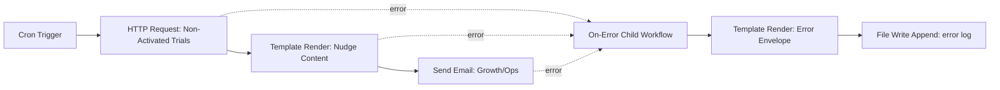

# Workflow Contract v3: Trial Activation Nudge

- Date: February 8, 2026
- Status: Draft for Gate 2, Gate 3, and Gate 4 approval
- Slice owner intent: Keep one small, high-value slice that businesses can run reliably on a single office laptop.

## 1) Decision Framing

- Decision: Ship one workflow slice that delivers:
1. ergonomic linking APIs (`link` and `on_error`) that accept blocks directly, not only pre-added IDs;
2. robust run behavior with workflow and block scoped logging using OpenTelemetry, with local-first operation.
- In scope: one use case (`Trial Activation Nudge`), existing built-in blocks only, no new data-source or transformation block families.
- Out of scope: distributed scheduling, multi-node coordination, full persistence subsystem migrations, new connector development.

## 2) Use Case and Value

- Use case: On a schedule, fetch non-activated trial data from an upstream endpoint, format a nudge summary, and send an operational nudge email.
- Primary actor: Growth/Ops owner.
- Trigger: cron schedule.
- Business value:
1. catches activation gaps early;
2. proves dependable local runtime behavior;
3. gives clear run and block debugging trails.

## 3) Scope Boundaries

### In Scope

1. API ergonomics for link and on-error wiring.
2. Error handling contract with domain-aware block errors plus runtime errors.
3. Retry and timeout behavior for robust runs.
4. Run and block logging with correlation IDs.
5. OpenTelemetry spans with optional OTLP export.
6. New example workflow for `Trial Activation Nudge`.

### Out of Scope

1. New block families (Airtable/Sheets/CSV/Excel expansions are deferred).
2. Visual builder/UI changes.
3. Distributed reliability semantics.
4. Workflow pause/resume/cancel semantics beyond current run-lifecycle scope.

## 4) Capability Classification Matrix

| Capability | Class | In Slice | Rationale |
| --- | --- | --- | --- |
| `link` accepts block specs directly | Built-in workflow API capability | Yes | Core API ergonomics, broad reuse across workflows |
| `on_error` accepts block specs directly | Built-in workflow API capability | Yes | Core error-routing ergonomics, broad reuse |
| Error taxonomy with runtime and block-domain layers | Built-in engine capability | Yes | Needed for actionable diagnostics and policy decisions |
| Retry and timeout policy execution | Built-in block capability | Yes | Reliability is block-owned where domain context exists |
| OTel workflow span + block spans | Built-in observability capability | Yes | Standard observability backbone |
| Local JSON run/block logs | Built-in observability capability | Yes | Laptop-first debugging without external dependencies |
| Optional OTLP exporter | Built-in observability capability | Yes | External observability integration when available |
| Trial activation workflow wiring | Child workflow composition | Yes | Concrete reusable pattern built from existing blocks |
| Domain-specific lead scoring logic | Custom block | No | Not required for this slice |
| New external connector blocks | Built-in block expansion | No | Explicitly deferred to keep slice reviewable |

## 5) API Contract (Public Surface)

## 5.1 Ergonomic Link Endpoints

- User flow is block-first: build block instances, configure block policies, then link blocks together.
- `Workflow::add(...)` remains supported for backward compatibility but is not required in the preferred flow.
- Block reliability policy is configured on the block instance itself via chainable setters (for example `set_retry`, `set_timeout`) before linking.
- `Workflow::link(from, to)` accepts each endpoint as:
1. block reference (preferred), e.g. `&Block`; or
2. inline block value (one-shot); or
3. existing `BlockId` (legacy-compatible).
- `Workflow::on_error(from, handler)` uses the same endpoint acceptance model.
- `Workflow::link_on_error(...)` remains as compatibility alias to `on_error(...)`.

### Semantics

1. If endpoint is `BlockId`, workflow uses existing registered block.
2. If endpoint is a block reference, workflow auto-registers it once and reuses it across links.
3. If endpoint is an inline block value, workflow treats it as one-shot and registers it for that link usage.
4. Internal holder IDs remain an engine detail and are not part of user-land API.
5. Existing `add + link(BlockId, BlockId)` code remains valid.

## 5.2 Ergonomic Usage Target

```rust
let mut w = orchestrator_blocks::new_workflow();

let trigger = orchestrator_blocks::Block::cron("0 */15 * * * * *");
let fetch = orchestrator_blocks::Block::http_request(Some("https://internal/trials/not-activated"))
    .set_timeout_ms(30_000)
    .set_retry_exponential(2, 1_000, 2.0);
let render = orchestrator_blocks::Block::template_handlebars(Some("{{{this}}}"), None);
let send = orchestrator_blocks::Block::send_email("growth@company.com", Some("Trial Activation Nudge"))
    .set_timeout_ms(30_000)
    .set_retry_exponential(3, 1_000, 2.0);
let err = orchestrator_blocks::Block::child_workflow(error_handler_def);

w.link(&trigger, &fetch);
w.link(&fetch, &render);
w.link(&render, &send);
w.on_error(&fetch, &err);
w.on_error(&render, &err);
w.on_error(&send, &err);
```

## 5.3 Reuse Rule (Important)

1. If a block must have multiple outgoing or error links, reuse the same block variable/reference.
2. Inline block values inside `link`/`on_error` are single-use and should not be relied on for implicit deduplication.

## 5.4 Block-Level Policy API

1. Reliability policy is owned and declared at block level from the user perspective.
2. Expected shape:
- `block.set_retry(...)`
- `block.set_timeout(...)`
- `block.set_...(...)` for future policy knobs.
3. If a block is reused across multiple links, the policy on that block instance is reused as-is.
4. Workflow-level wiring methods (`link`, `on_error`) do not carry reliability policy parameters.

## 6) Robust Run Contract

### Run Lifecycle States

- In-memory run states for each run:
1. `created`
2. `running`
3. `succeeded`
4. `failed`
5. `timed_out`

### 6.2 Run Context and Logging Context Propagation

1. This slice does not persist run state to file/database.
2. Runtime keeps a mutable in-memory `RunContext` that is passed through execution paths.
3. `RunContext` includes at minimum: `workflow_id`, `run_id`, `block_id` (active), `attempt`, `ts`.
4. Built-in and custom block logging APIs automatically enrich emitted logs with `workflow_id`, `run_id`, and `block_id`.
5. Custom blocks can log through SDK logging helpers and receive automatic context enrichment.

### Retry and Timeout Behavior

1. Retry and timeout are block-owned behaviors implemented by the block executor itself.
2. Workflow runtime does not apply a generic cross-block retry engine.
3. Retries are bounded by each block policy (`max_attempts`).
4. `backoff` retries include computed delay metadata.
5. Timeout is enforced according to each block policy.
6. Runtime receives only terminal block outcomes and then routes terminal errors to `on_error` handlers.
7. Run remains `failed` when core block path fails even if `on_error` handlers succeed.

### 6.3 Built-in Block Reliability Defaults (All Current Built-ins)

Policy notation:

- Retry count means additional attempts after first execution.
- Backoff `exp(1s, factor=2, jitter=20%, cap=30s)` unless noted.
- Timeout `none` means block implementation has no timeout by default.

| Block Type | Domain | Default Timeout | Default Retries | Backoff | Default Retryable Conditions |
| --- | --- | --- | --- | --- | --- |
| `cron` | `cron` | `none` | `0` | `n/a` | none (schedule misconfig and runtime errors fail fast) |
| `http_request` | `http` | `30s` | `2` | `exp(1s)` | connect/reset/timeout, HTTP 429, HTTP 5xx |
| `send_email` | `email` | `30s` | `3` | `exp(1s)` | SMTP transient/server-unavailable/timeouts |
| `ai_generate` | `ai` | `120s` | `2` | `exp(2s)` | upstream timeout, rate limit, provider 5xx |
| `file_read` | `file` | `none` | `0` | `n/a` | none (path/config issues are non-retryable by default) |
| `file_write` | `file` | `none` | `0` | `n/a` | none (content/path/config issues fail fast) |
| `list_directory` | `file` | `none` | `0` | `n/a` | none |
| `combine` | `transform` | `none` | `0` | `n/a` | none |
| `custom_transform` | `transform` | `none` | `0` | `n/a` | none |
| `markdown_to_html` | `transform` | `none` | `0` | `n/a` | none |
| `template_handlebars` | `template` | `none` | `0` | `n/a` | none |
| `rss_parse` | `transform` | `none` | `0` | `n/a` | none |
| `split_lines` | `transform` | `none` | `0` | `n/a` | none |
| `split_by_keys` | `transform` | `none` | `0` | `n/a` | none |
| `select_first` | `transform` | `none` | `0` | `n/a` | none |
| `child_workflow` | `child_workflow` | `infinite` | `0` | `n/a` | none at parent boundary unless explicitly set on child-workflow block instance |

### 6.4 Policy Resolution Rules

1. Explicit block policy via block setters (`set_retry`, `set_timeout`, etc.) on that block instance.
2. Built-in default in table above (when block policy is not explicitly set).
3. For custom blocks without declared policy, default to `timeout=none`, `retries=0`.

### 6.5 Transform Family Rule (Confirmed)

1. Transform-style built-ins (`combine`, `custom_transform`, `markdown_to_html`, `template_handlebars`, `rss_parse`, `split_lines`, `split_by_keys`, `select_first`) default to:
- no retries;
- no timeout.
2. Rationale: these are deterministic local compute/formatting steps; retrying usually repeats the same failure and adds noise.

### 6.6 Child Workflow Reliability Boundary

1. `child_workflow` is treated as a block instance in the parent graph.
2. By default, child-workflow block policy is:
- timeout: `infinite`
- retries: `none`
3. Users can set policy on the child-workflow block instance to control reliability for the entire child workflow execution.
4. If child-workflow policy retries, each retry reruns the child workflow from child entry.
5. Any error inside child blocks bubbles to the parent as a child-workflow error envelope with child cause metadata.

## 7) Error Contract v3 (Layered Model)

## 7.1 Error Origin

- `runtime`: scheduler/graph/execution/store failures owned by engine.
- `block`: domain-specific failures emitted by block executors.

## 7.2 Runtime Error Codes (Engine-Owned)

- `runtime.timeout`
- `runtime.canceled`
- `runtime.panic`
- `graph.invalid`
- `graph.iteration_budget_exceeded`
- `state_store.write_failed`

## 7.3 Block Error Shape (Domain-Owned)

- Required fields:
1. `domain` (examples: `http`, `email`, `file`, `template`, `cron`, `transform`, `child_workflow`, `custom:<type_id>`)
2. `code` (domain code, for example `http.auth.401`, `email.smtp.auth_failed`, `file.not_found`)
3. `message`
- Optional fields:
1. `provider_status` (HTTP status, SMTP code, OS code, etc.)
2. `details` (structured diagnostic payload)

## 7.4 Cross-Cutting Operational Semantics

- `retry_disposition`: `never | immediate | backoff | manual`
- `severity`: `info | warn | error | critical`

## 7.5 Built-in Domain Code Baselines

These are required baseline codes for built-ins to keep logs and policies consistent:

1. `http_request`: `http.timeout`, `http.rate_limited.429`, `http.server_error.5xx`, `http.auth.401`, `http.forbidden.403`, `http.invalid_request`.
2. `send_email`: `email.smtp.auth_failed`, `email.smtp.timeout`, `email.smtp.transient`, `email.smtp.permanent`.
3. `file_read`/`file_write`/`list_directory`: `file.not_found`, `file.permission_denied`, `file.invalid_path`, `file.io`.
4. `template_handlebars`: `template.render_failed`, `template.missing_data`, `template.invalid`.
5. `ai_generate`: `ai.auth`, `ai.rate_limited`, `ai.timeout`, `ai.provider_5xx`, `ai.invalid_response`.
6. `cron`: `cron.invalid_expression`, `cron.runtime_error`.
7. Transform family: `transform.invalid_input`, `transform.parse_failed`, `transform.execution_failed`.

## 7.6 `on_error` Envelope

On error routing, handler input resolves to an envelope carrying:

1. `origin`
2. `domain` (when origin is `block`)
3. `code`
4. `message`
5. `retry_disposition`
6. `severity`
7. `workflow_id`
8. `run_id`
9. `block_id`
10. `attempt`
11. `provider_status` (optional)
12. `ts`

## 7.7 `on_error` Parallel Handler Semantics

1. If multiple handlers are attached to a failing source block, runtime executes all handlers in parallel.
2. Every handler receives the same immutable error envelope for that failure.
3. Handler outcomes are logged independently (`on_error.handler_succeeded` / `on_error.handler_failed`).
4. Failure of one handler does not cancel sibling handlers.
5. Parent workflow run state remains `failed` after source-path failure, regardless of handler outcomes.

## 8) Logging and OpenTelemetry Contract

### Logging Scope

1. Workflow-scoped events.
2. Block-scoped events.
3. Retry, timeout, and on-error routing events.

### Required Correlation Fields

- `workflow_id`
- `run_id`
- `block_id` (block events)
- `attempt`
- `origin`
- `domain`
- `code`
- `trace_id`
- `span_id`
- `ts`

### Event Types

- `run.created`
- `run.started`
- `block.started`
- `block.succeeded`
- `block.failed`
- `block.retry_scheduled`
- `on_error.handler_started`
- `on_error.handler_succeeded`
- `on_error.handler_failed`
- `run.succeeded`
- `run.failed`
- `run.timed_out`

### Sink Strategy (Confirmed)

- Mode C:
1. local JSON logs enabled by default;
2. optional OTLP exporter enabled when configured.

## 9) Workflow Graph (Success + Error)



## 10) Data-Shape Map (Key Boundaries)

| Boundary | Input Shape | Output Shape |
| --- | --- | --- |
| `cron` | `Empty` | `Text(timestamp)` |
| `http_request` | `Text(url)` or config URL | `Text(response_body)` |
| `template_handlebars` main path | response text/json | nudge email body text/html |
| `send_email` | body text/json | `Json({\"sent\": true, \"to\": ...})` |
| `on_error` child workflow | error envelope | appended error log line |

## 11) Edge Cases

1. Upstream endpoint returns malformed body.
2. HTTP endpoint unavailable or times out.
3. SMTP unavailable or auth failure.
4. Error handler itself fails.
5. Multiple consecutive failures with retries exhausted.
6. Unknown custom block error domain/code.
7. OTel exporter unavailable while local logs must still succeed.

## 12) Acceptance Criteria and Measurable Signals

1. New API allows block-spec endpoints directly in `link` and `on_error`.
2. Backward compatibility is preserved for existing ID-based links.
3. Runtime emits in-memory run status transitions for each run.
4. Retry and timeout behavior is deterministic and test-covered.
5. Error envelopes include origin + domain + code + retry disposition.
6. Logs include required correlation fields and can reconstruct one failing run end-to-end.
7. OTel spans exist for workflow run and each block execution.
8. Example workflow runs via the same production runtime path.
9. Multiple `on_error` handlers for one source execute in parallel.

## 13) Example Workflow Spec (Required New Example)

- Name: `trial_activation_nudge`
- Intent: Scheduled detection and notification for non-activated trials.
- Blocks: existing built-ins only (`cron`, `http_request`, `template_handlebars`, `send_email`, `file_write` via child on-error logger).
- Expected output:
1. successful run sends nudge email;
2. failures produce structured on-error log entries;
3. run and block telemetry/log traces are queryable by `run_id`.

## 14) Risks, Assumptions, Deferred

### Risks

1. Upstream endpoint schema drift can reduce template reliability.
2. Domain error mapping consistency may vary across built-ins initially.
3. OTLP availability should never block local run completion.

### Assumptions

1. Trial candidate data is exposed by an upstream endpoint.
2. SMTP credentials are configured for send-email execution.
3. Single-device runtime reliability is the primary optimization target.

### Deferred

1. New data-source and transformation block families.
2. Distributed scheduling guarantees.
3. Full pause/resume/cancel and checkpoint replay semantics.

## 15) Contract Delta History

- `v1`: initial API ergonomics discussion and workflow ideation.
- `v2`: added robust runs and OTel + local logging scope.
- `v3`: replaced flat generic error classes with layered runtime + block-domain error model.
- `v3.1`: removed clone-based usage target and moved to block-first reuse semantics (reuse the same block reference across links).
- `v3.2`: added built-in reliability defaults for all block types (timeouts, retries, backoff, retryability), including confirmed transform no-retry/no-timeout policy and fixed HTTP/email defaults.
- `v3.3`: moved reliability control to block-level policy API, defined child-workflow reliability boundary and error bubbling, required block-owned domain codes, in-memory run context for automatic log enrichment, and parallel execution semantics for multiple `on_error` handlers.

## 16) Approval Gates Pending

1. Gate 2: breakdown approval.
2. Gate 3: `Workflow Contract v3.3` approval.
3. Gate 4: upgrade plan approval before coding.
