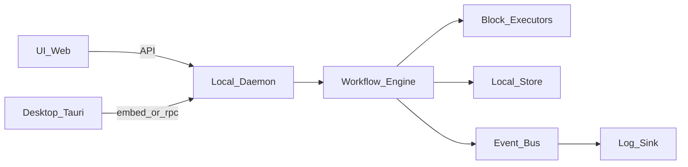

# Local Orchestrator Roadmap

## Target architecture (async + daemon + embedded)

- Async Tokio runtime with a queue-based scheduler, worker pools, parallel links, and cycle-aware iteration limits.
- Dual integration: local daemon API for headless use + embedded library mode for desktop (selected).
- Event bus for run/block lifecycle events feeding structured logs, UI, and external subscribers.
- Local persistence with SQLite (default) plus YAML import/export for versioned workflows.

## Demonstration rule

- Each phase ends with a working demo that can be run locally.
- Demos live as sample workflows in `crates/orchestrator-examples/`, with a minimal run command or UI path documented.

## User-facing API focus

- Users build workflows via `Workflow::new()`, `add(Block)`, `link(BlockId, BlockId)`, and `run()`.
- Blocks are created with strong configs; optional config (like file path) can be provided now or supplied at run time via input.
- The public surface stays at this level; `WorkflowDefinition`, `WorkflowRun`, `BlockRegistry`, and `runtime` remain internal.
- The user focus is on blocks, their configuration, and linking them into a workflow.

## Phase 1: Async core + typed IO (Rust library)

- Define `WorkflowDefinition` (nodes, edges, ports, conditions) and `WorkflowRun` state machine; refactor [backend/src/workflow.rs](backend/src/workflow.rs).
- Replace `Option<String>` IO with typed `BlockInput`/`BlockOutput` enums (serde-able, versioned); refactor [backend/src/block/mod.rs](backend/src/block/mod.rs) and modules under [backend/src/block/](backend/src/block/).
- Implement async scheduler with parallel edges, multiple-next execution, cycle handling (iteration budget + run tokens), and concurrency controls.
- Build internal definition/builder and block registry while exposing a minimal build-and-run API (`Workflow`, `Block`, `BlockId`).
- Demo: parallel + cyclic workflow executed via `cargo run`, no UI required.

## Phase 2: Block SDK + sample runner

- Create a simple block SDK: base trait, input/output helpers, error types, and block template docs.
- Add a minimal sample runner/CLI for `cargo run` to execute sample workflows using the `Workflow`/`Block` API.
- Demo: add a new custom block in <30 minutes and run a sample workflow using it.

## Phase 3: AI harness upgrades

- Add provider abstraction and model config; move OpenAI specifics behind a trait in [backend/src/block/ai/](backend/src/block/ai/).
- Add token usage tracking, cost budgets, eval mode, and tool-provider switching.
- Allow external subscriptions to AI events (prompt, response, tool call, cost).
- Demo: AI workflow that switches models and respects a cost budget.

## Phase 4: Eventing + logging

- Introduce `RunEvent`/`BlockEvent` bus with subscriptions; wire into engine and blocks.
- Expand [backend/src/logger.rs](backend/src/logger.rs) to structured logs (JSON + file rotation) and link to the event bus.
- Add diagnostics helpers and trace correlation IDs per run.
- Demo: stream events to console + log file and show per-block timings.

## Phase 5: Robust runs

- Add retry policies, timeouts, failure classification, and idempotency keys.
- Implement pause/resume/cancel and partial restart (by block or checkpoint).
- Add run metrics and failure reporting.
- Demo: a flaky block retries, then a paused run resumes from last checkpoint.

## Phase 6: Persistence + YAML

- Add local store (SQLite) for workflows, versions, runs, and logs; include migrations.
- YAML import/export for versioned workflows and block configs.
- Point-in-time restart from persisted run checkpoints.
- Demo: import YAML, run it, then list run history and replay from a checkpoint.

## Phase 7: Undo system

- Define `UndoAction` per block and record side effects at run time.
- Implement run-level undo and undo-to-block for a run.
- Demo: file write workflow undone to the previous state.

## Phase 8: Daemon API (optional)

- Implement local daemon API for workflow CRUD, run control, logs, and replay.
- Keep embedded API for Tauri via feature flags to reuse the same core engine.
- Demo: start daemon, run a workflow via CLI, and tail live events.

## Phase 9: Web UI (Next.js static)

- Build a workflow canvas editor (React Flow), block library, detail editor.
- Load/save YAML; validate and visualize graph; download YAML.
- Provide a minimal "run locally" panel for debugging against the daemon.
- Demo: create a workflow in UI, run it locally, and view live logs.

## Phase 10: Desktop (Tauri) + monitoring

- Integrate the web UI in Tauri and connect to daemon or embedded mode.
- Add workflow list and run controls (play/pause/resume/stop).
- Add monitoring: run logs, block-level logs, replay.
- Demo: desktop app runs a workflow and shows a block timeline.

## Phase 11: Delivery + testing + performance

- Package installers and improve onboarding across OSs.
- Unit/integration tests for engine, blocks, and storage; E2E tests for UI.
- Performance controls (workers, max threads, queue sizes) with safe defaults.
- Demo: install, run, and benchmark with tuned concurrency settings.

## Cross-cutting quality rules

- Prefer strong types over ad-hoc strings or `serde_json::Value`.
- Keep modules small and cohesive; split large files early.
- Separate conceptual concerns at high levels (core, blocks, runtime, storage).
- Favor conventions and simple patterns over heavy abstractions.
- Prefer explicit, copyable boilerplate over complex generic type tricks.
- Do more with less: prefer fewer lines when clarity is equal.
- Prioritize ergonomics and ease of use in the public API.
- Use clear, unambiguous names for types, modules, and workflows.
- Add unit tests where behavior is non-trivial or regressions are likely.
- Treat demo workflows as first-class artifacts and keep them runnable.
