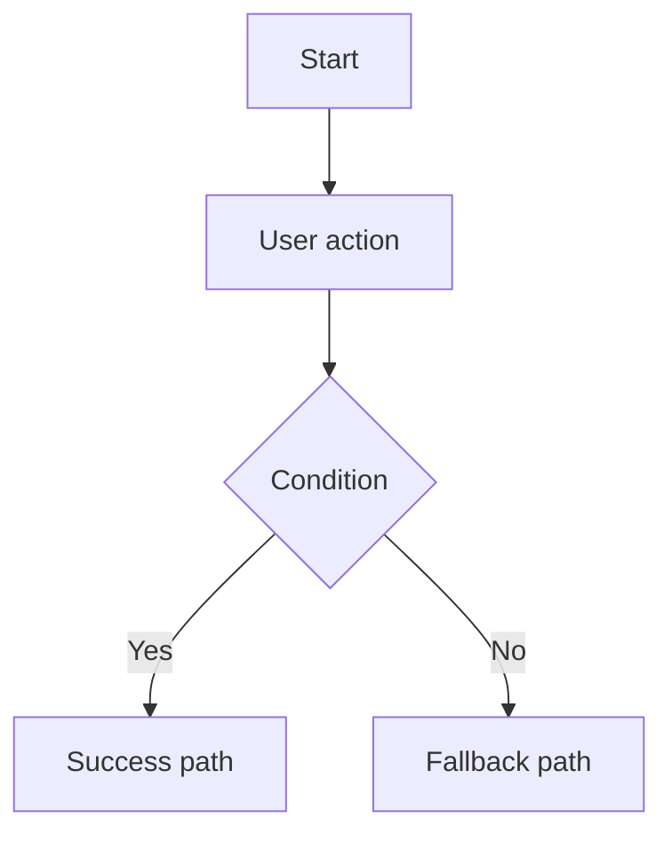

# Flowchart: <prd-id>

## Metadata

- PRD ID:
- Author:
- Date:
- Related PRD:

## Flowchart

```mermaid
flowchart TD
    A[Start] --> B[User action]
    B --> C{Condition}
    C -->|Yes| D[Success path]
    C -->|No| E[Fallback path]
```

## Notes

- Decision criteria:
- Failure handling:
