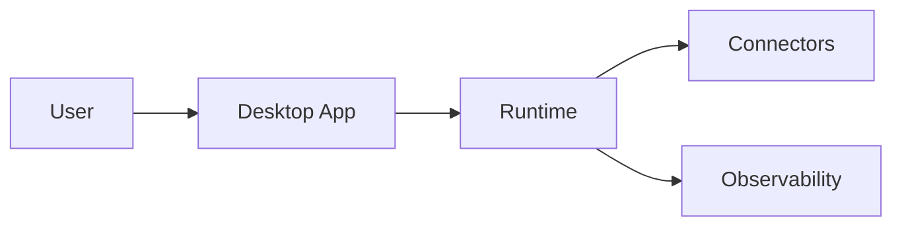

# System Diagram: <name>

## Metadata

- Diagram ID:
- Related PRD ID:
- Author:
- Date:

## Diagram

```mermaid
flowchart LR
    U[User] --> A[Desktop App]
    A --> R[Runtime]
    R --> C[Connectors]
    R --> O[Observability]
```

## Notes

- Scope:
- Interfaces:
- Failure boundaries:
